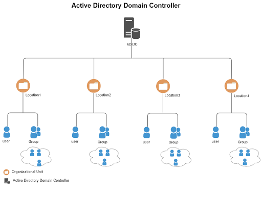
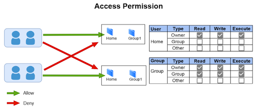
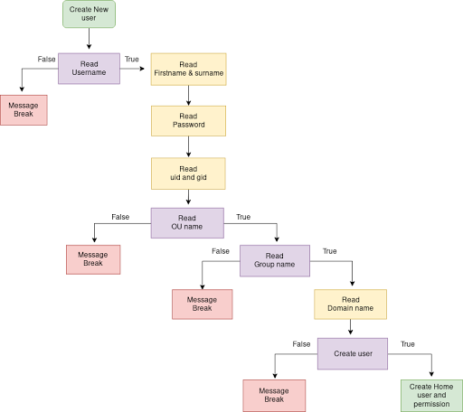
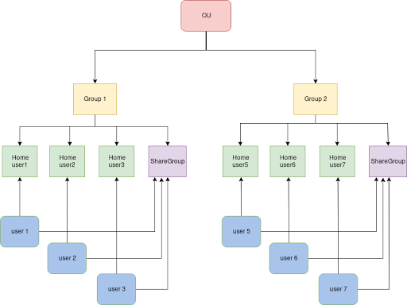

```
Version : 0.5.0
Title : KOOMPI Enterprice
Update : September-26-2020
```
##  Introduction to KOOMPI Enterprise Server

KOOMPIEnterprise is base on KOOMPI OS  an Active Directory compatible open source Linux server for small businesses and simple networks. The management console lets you manage users, share files, and configure DHCP and DNS. KOOMPIEnterprise utilizes a technology called Samba, which is an open source implementation of the Active Directory framework. Although Samba is not actually Active Directory, it is designed to provide the same services and is compatible with almost all Active Directory components which provide network management services, such as  
user authentication and computer management.

It is as a designed simple and easy to use system, here are the main features of KOOMPIEnterprise.

## Active Directory Domain Controller
```
+ Active Directory Compatible Domain with Samba 4
+ User Management
+ Central domain and directory management
+ Users, Security groups, Distribution lists, Contacts
+ Multiple Organization Units (OUs), Group Policy Objects (GPOs)
+ Users and Groups access and modification permissions (ACLs)
+ Integrated software: Samba
```
## New Feature

* Fix error syntax on samba
* Fix pam.d authentication
* Update user management and setup script

## Package Version
* bind-tools-9.16.6-1
* krb5-1.18.2-1
* ntp-4.2.8.p15-1
* openresolv-3.11.0-1
* samba-4.12.6-1
* bind-9.16.6-1
* dhcp-4.4.2-2
* vsftpd-3.0.3-7

## How to Install KOOMPI Enterprise
```
$ git clone --depth 1 https://github.com/koompi/enterprise-server.git && cd enterprise-server
$ sudo ./setup.sh
```

## Pionux Struture


## Permission


## User Management

After install you will see application on Desktop "User Management" . In User Management have :
```
1. User, Group ,OU : is for create user, group, ou , setting password and setting user .
2. Computer : is for show computer that joined in domain and add computer to domain.
3. Storage : is for show storage of computer .
4. Service : is for show all service is running.
```



## Client Access

